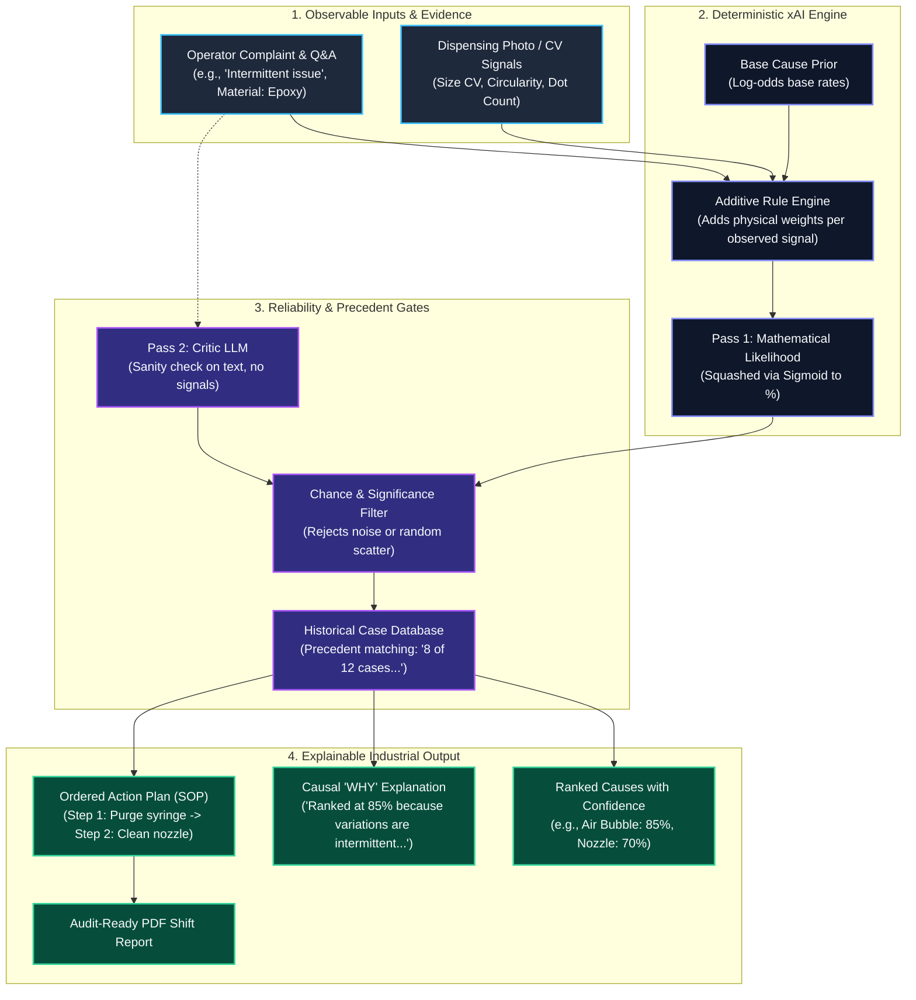

```mermaid
flowchart TD
    %% Styling
    classDef inputStyle fill:#1e293b,stroke:#38bdf8,stroke-width:2px,color:#f8fafc;
    classDef engineStyle fill:#0f172a,stroke:#818cf8,stroke-width:2px,color:#f8fafc;
    classDef gateStyle fill:#312e81,stroke:#a855f7,stroke-width:2px,color:#f8fafc;
    classDef outputStyle fill:#064e3b,stroke:#34d399,stroke-width:2px,color:#f8fafc;

    %% 1. Inputs
    subgraph Inputs ["1. Observable Inputs & Evidence"]
        A1["Operator Complaint & Q&A<br/>(e.g., 'Intermittent issue', Material: Epoxy)"]:::inputStyle
        A2["Dispensing Photo / CV Signals<br/>(Size CV, Circularity, Dot Count)"]:::inputStyle
    end

    %% 2. Dual-Pass Diagnostics
    subgraph DiagnosticEngine ["2. Deterministic xAI Engine"]
        B1["Base Cause Prior<br/>(Log-odds base rates)"]:::engineStyle
        B2["Additive Rule Engine<br/>(Adds physical weights per observed signal)"]:::engineStyle
        B3["Pass 1: Mathematical Likelihood<br/>(Squashed via Sigmoid to %)"]:::engineStyle
        
        B1 --> B2 --> B3
    end

    %% 3. Dual-Pass & Validation Gates
    subgraph ValidationGates ["3. Reliability & Precedent Gates"]
        C1["Pass 2: Critic LLM<br/>(Sanity check on text, no signals)"]:::gateStyle
        C2["Chance & Significance Filter<br/>(Rejects noise or random scatter)"]:::gateStyle
        C3["Historical Case Database<br/>(Precedent matching: '8 of 12 cases...')"]:::gateStyle
    end

    %% 4. Outputs
    subgraph ExplainableOutput ["4. Explainable Industrial Output"]
        D1["Ranked Causes with Confidence<br/>(e.g., Air Bubble: 85%, Nozzle: 70%)"]:::outputStyle
        D2["Causal 'WHY' Explanation<br/>('Ranked at 85% because variations are intermittent...')"]:::outputStyle
        D3["Ordered Action Plan (SOP)<br/>(Step 1: Purge syringe -> Step 2: Clean nozzle)"]:::outputStyle
        D4["Audit-Ready PDF Shift Report"]:::outputStyle
    end

    %% Flow connections
    A1 --> B2
    A2 --> B2
    A1 -.-> C1

    B3 --> C2
    C1 --> C2
    C2 --> C3

    C3 --> D1
    C3 --> D2
    C3 --> D3
    D3 --> D4
```